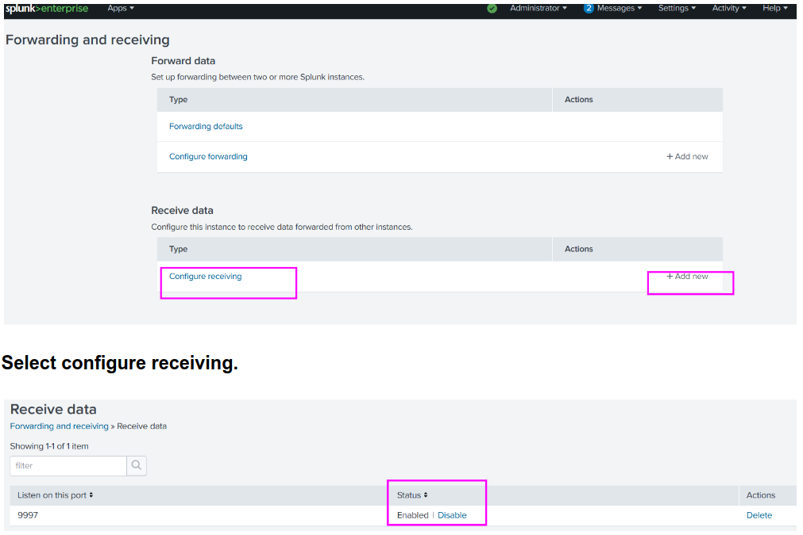
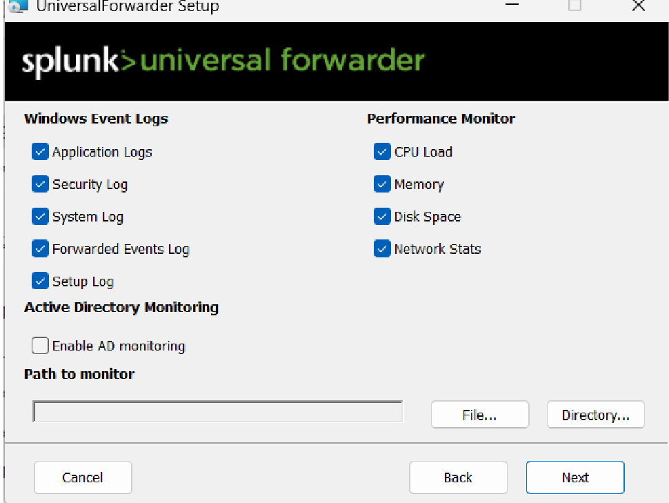
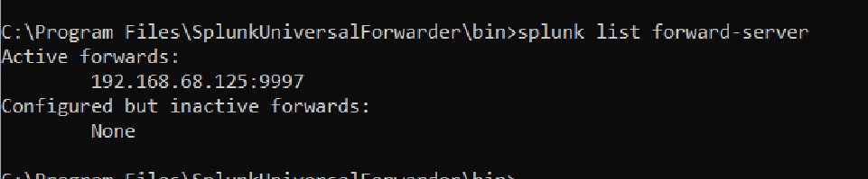
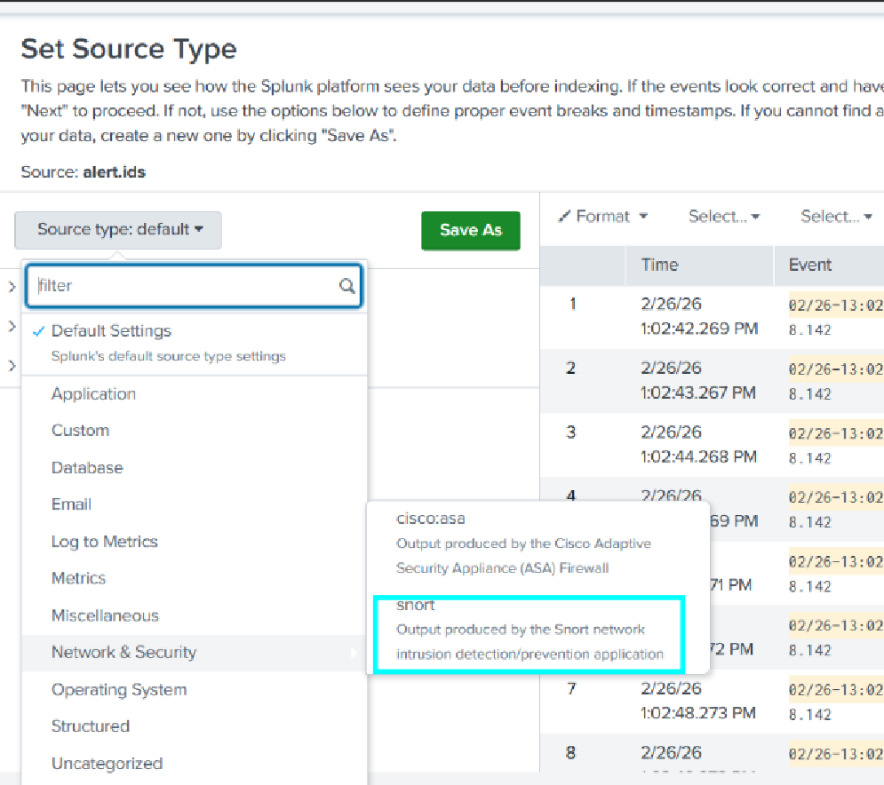
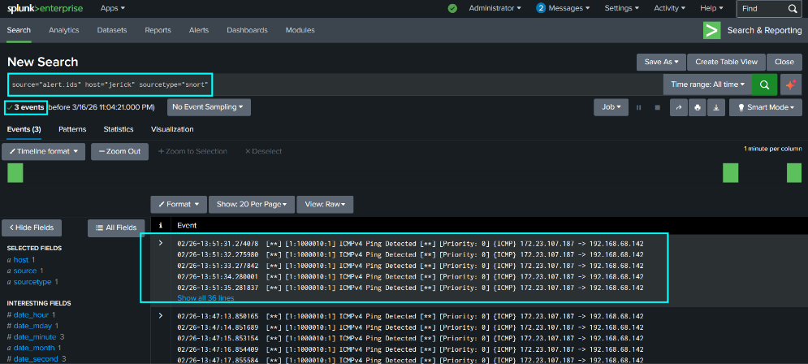
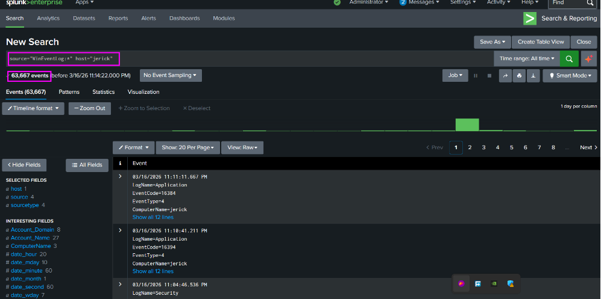
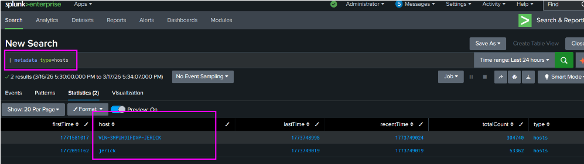
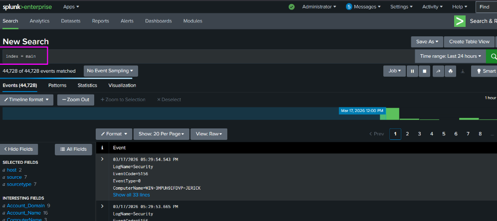

# Lab 01: Multi-Source Telemetry Ingestion & Forwarding Pipeline

## Architecture Overview
This module establishes the core SIEM logging architecture. Telemetry generated on a target Windows Server (`WIN-3MPUH9IFDVP-JERICK`) is forwarded to an indexing engine over TCP port 9997 using the Splunk Universal Forwarder, alongside file monitors for network intrusion detection logs.

```text
+-----------------------------------------------------------------------+
|                    Target Host: Windows Server                        |
|                     (WIN-3MPUH9IFDVP-JERICK)                          |
|                                                                       |
|   +-----------------------+     +-------------------------------+     |
|   |  Windows Event Logs   |     |     Network Intrusion Logs    |     |
|   |  Security / System    |     |      Snort (alert.ids)        |     |
|   +-----------+-----------+     +---------------+---------------+     |
|               |                                 |                     |
|               +---------------+-----------------+                     |
|                               |                                       |
|                               v                                       |
|             [Splunk Universal Forwarder Service]                      |
+-------------------------------+---------------------------------------+
                                |
                                | Ingestion Stream (TCP 9997)
                                v
+-----------------------------------------------------------------------+
|                    Splunk Enterprise Indexer                          |
|                     (Index: main / test)                              |
+-----------------------------------------------------------------------+
```

---

## Stage 1: Indexer Receiving Pipeline Configuration

Before deploying client forwarders, Splunk Enterprise was configured to accept incoming TCP traffic:
1. Navigated to **Settings > Forwarding and Receiving > Receive Data**.
2. Bound a listener on standard Splunk ingestion port `9997`.



---

## Stage 2: Splunk Universal Forwarder Deployment

The Splunk Universal Forwarder (UF) was deployed on the Windows Server target host running under the `Local System` account.

### 1. Ingestion Channel Selection
Core operational and security event logs were selected during initialization:
* Windows Event Logs: `Application`, `Security`, `System`, and `Forwarded Events`
* Performance Counters: `CPU Load`, `Memory`, `Disk Space`, and `Network Stats`



### 2. Forwarding Route Activation
The forwarder service was started and directed toward the indexing server IP (`192.168.68.125:9997`):

```cmd
cd "C:\Program Files\SplunkUniversalForwarder\bin"
splunk start
splunk add forward-server 192.168.68.125:9997
splunk list forward-server
```

The forwarder verified the remote listener status:



---

## Stage 3: Network Intrusion Detection (Snort) Ingestion

Network-level telemetry from Snort (`alert.ids`) was ingested to capture packet-level anomalies (ICMP sweeps, port scans).

1. Ingested via **Settings > Add Data > Monitor > Files & Directories**.
2. Specified target log file: `C:\Snort\log\alert.ids`[cite: 1].
3. Mapped the parsing format to the native `snort` sourcetype under **Network & Security**.



### Verification Search:
```spl
source="alert.ids" sourcetype="snort"
```


---

## Stage 4: Windows Security & Service Log Inputs

Direct Windows Security Event Log indexing was configured to establish the identity and authentication baseline:

```spl
source="WinEventLog:*" host="jerick"
```


### OpenSSH Operational Channel Authorization
To index Windows OpenSSH logon traffic, channel access permissions were granted via `wevtutil`:

```powershell
wevtutil sl OpenSSH/Operational /ca:"O:BAG:SYD:(A;;0xf0007;;;SY)(A;;0x7;;;BA)(A;;0x3;;;IU)(A;;0x3;;;SU)"
```

Configured in `C:\Program Files\SplunkUniversalForwarder\etc\system\local\inputs.conf`:
```ini
[WinEventLog://OpenSSH/Operational]
disabled = 0
renderXml = true
index = main
```

---

## Stage 5: Ingestion Pipeline Health Verification

### 1. Host Ingestion Inventory
Confirmed real-time event indexing across all participating endpoints:
```spl
| metadata type=hosts
```


### 2. Index Main Population
Verified total indexed event baseline in `index=main`:
```spl
index=main
```

