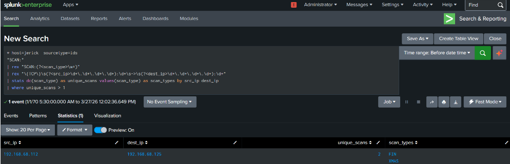
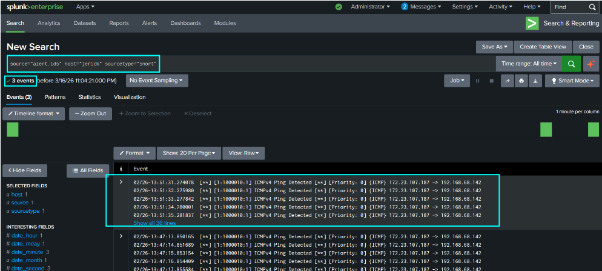
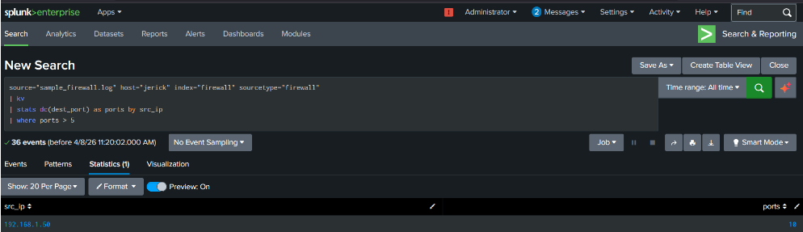

# Lab 02: Network Reconnaissance & Perimeter Threat Detections

## Overview
This module demonstrates network-layer intrusion detection and perimeter traffic analytics. Ingesting alerts from a Snort Network Intrusion Detection System (NIDS) and enterprise firewall logs, custom Search Processing Language (SPL) queries were engineered to detect reconnaissance scans, ping sweeps, brute-force attempts, and unauthorized East-West lateral movement.

---

## 1. Nmap Network Scan Detection (Snort NIDS)

### Adversary Behavior
An external attacker executed network discovery scans against the infrastructure to identify exposed services and open ports.

### Telemetry Pipeline
* **Source:** `alert.ids`
* **Host:** `jerick`
* **Sourcetype:** `ids`

### SPL Analytics
Extracts scan signatures and maps unique TCP source-to-destination connection patterns:

```spl
* host=jerick sourcetype=ids "SCAN:"
| rex "SCAN:(?<scan_type>\w+)"
| rex "\{TCP\}\s(?<src_ip>\d+\.\d+\.\d+\.\d+):\d+\s->\s(?<dest_ip>\d+\.\d+\.\d+\.\d+):\d+"
| stats dc(scan_type) as unique_scans values(scan_type) as scan_types by src_ip dest_ip
| where unique_scans > 1
```



### Triage Analysis
* **Analyst Action:** Assesses whether a single external IP triggered multiple signature flags (e.g., SYN scan, NULL scan, FIN scan) against target host assets within a short timeframe.

---

## 2. High-Frequency Ping Sweep Detection (ICMP Flood)

### Adversary Behavior
Adversaries execute ICMP sweeps during host discovery to map live endpoints across a target subnet.

### SPL Analytics
Uses regular expressions to parse raw Snort log timestamps, source IPs, and target destination IPs, then aggregates hit counts:

```spl
index=* sourcetype="snort" "ICMPv4 Ping Detected"
| rex "^(?<raw_time>\d{2}/\d{2}-\d{2}:\d{2}:\d{2}\.\d+)"
| rex "\{ICMP\}\s(?<src_ip>\d+\.\d+\.\d+\.\d+)\s->\s(?<dst_ip>\d+\.\d+\.\d+\.\d+)"
| stats count as ping_count by _time src_ip dst_ip
```



---

## 3. Firewall Perimeter Traffic Analytics

### A. Aggressive Port Scan Detection
Identifies external hosts hitting more than 8 distinct destination ports in the firewall telemetry:

```spl
source="sample_firewall.log" host="jerick" index="firewall" sourcetype="firewall"
| kv
| stats dc(dest_port) as unique_ports count by src_ip
| where unique_ports > 8
| sort -unique_ports
```



### B. Low-and-Slow Port Scan
Flags evasive scanning activity by bucketing traffic into 10-minute time intervals:

```spl
index=firewall | kv
| bin _time span=10m
| stats dc(dest_port) as unique_ports by src_ip _time
| where unique_ports > 2
| sort _time
```

### C. SSH Service Brute-Force via Firewall Denials
Detects targeted external connection attempts to port 22 resulting in firewall drops:

```spl
source="sample_firewall.log" host="jerick" index="firewall" sourcetype="firewall"
| kv
| search dest_port=22 action=DENY
| stats count by src_ip
| where count > 5
```

### D. Volumetric Denial of Service (DoS) Pattern
Surfaces anomalous traffic volume directed at specific service ports:

```spl
index=firewall | kv
| stats count by src_ip dest_port
| where count > 4
```

### E. Data Exfiltration via Volume Spike
Aggregates total outbound payload sizes by source IP to identify large egress volumes:

```spl
index=firewall | kv
| stats sum(bytes) as total_bytes by src_ip
| sort -total_bytes
```

---

## 4. Internal Lateral Movement Detection (East-West Traffic)

### Attack Logic
When an attacker compromises a host on an internal subnet (`172.16.0.0/12`), they attempt discovery against adjacent internal hosts.

### Detection Rule
Filters for events where both source and destination IPs match private address spaces, alerting when a single internal IP probes multiple adjacent internal targets:

```spl
index=firewall | kv
| eval internal_src=if(match(src_ip,"^172\.16\."),1,0)
| eval internal_dest=if(match(dest_ip,"^172\.16\."),1,0)
| where internal_src=1 AND internal_dest=1
| stats dc(dest_ip) as targets by src_ip
| where targets > 2
```
