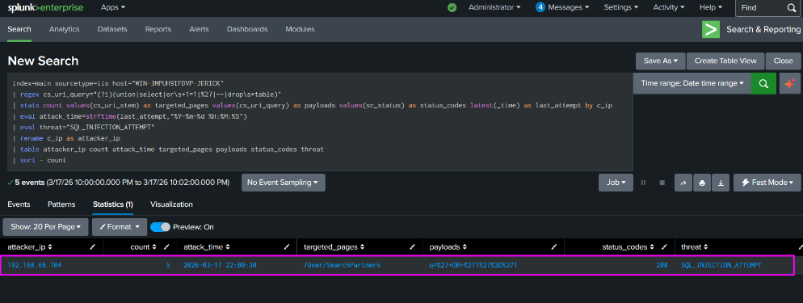
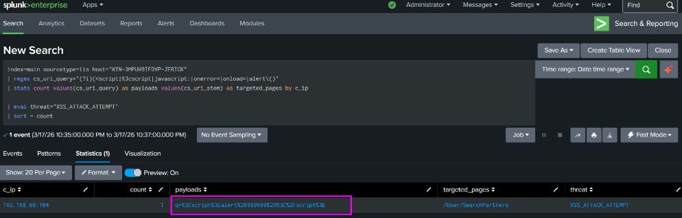
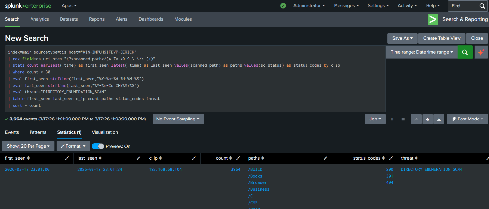
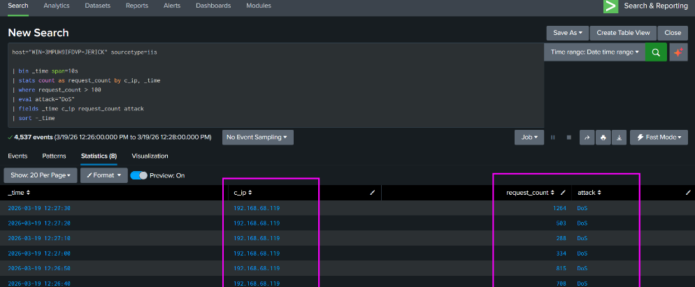
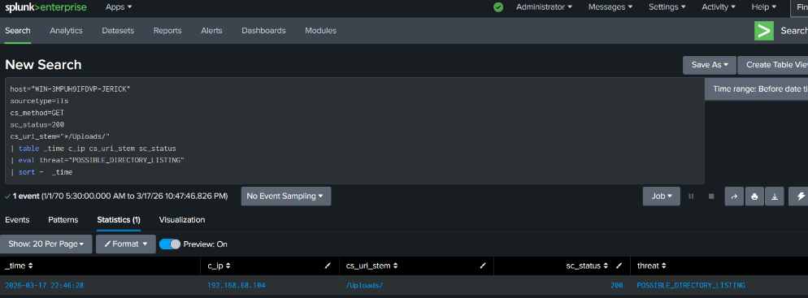
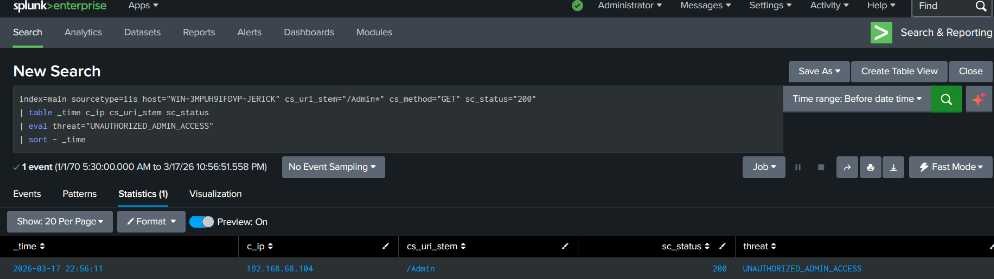

# Lab 03: Web Application Threat Detection (IIS W3C Logs)

## Ingestion Overview
* **Target Host:** `WIN-3MPUH9IFDVP-JERICK`
* **Log Source:** Microsoft IIS W3C Extended Logs (`C:\inetpub\logs\LogFiles\W3SVC2\*.log`)
* **Sourcetype:** `iis`
* **Target Applications:** Web services and admin interfaces hosted via IIS / ASP.NET

---

## 1. SQL Injection (SQLi) Detection

### Attack Objective
An adversary attempted to extract database backend information and bypass authentication mechanisms by injecting SQL syntax through HTTP GET request parameters.

### Splunk SPL Detection
```spl
index=main sourcetype=iis host="WIN-3MPUH9IFDVP-JERICK"
| regex cs_uri_query="(?i)(union|select|or\s+1=1|%27|--|drop\s+table)"
| stats count values(cs_uri_stem) as targeted_pages values(cs_uri_query) as payloads values(sc_status) as status_codes latest(_time) as last_attempt by c_ip
| eval attack_time=strftime(last_attempt,"%Y-%m-%d %H:%M:%S")
| eval threat="SQL_INJECTION_ATTEMPT"
| rename c_ip as attacker_ip
| table attacker_ip count attack_time targeted_pages payloads status_codes threat
| sort - count
```



### Triage Analysis
* **Payload Evaluation:** Assesses whether SQL keywords (`UNION`, `SELECT`, `--`) resulted in HTTP `500` internal server errors (potential blind injection) or HTTP `200` OK responses.
* **Response:** Extract `attacker_ip` and block at the perimeter firewall if high confidence of exploitation is confirmed.

---

## 2. Reflected Cross-Site Scripting (XSS)

### Attack Objective
Execution of client-side malicious scripts injected via URI parameters to hijack active administrative sessions.

### Splunk SPL Detection
```spl
index=main sourcetype=iis host="WIN-3MPUH9IFDVP-JERICK"
| regex cs_uri_query="(?i)(<script|%3cscript|javascript:|onerror=|onload=|alert\()"
| stats count values(cs_uri_query) as payloads values(cs_uri_stem) as targeted_pages by c_ip
| eval threat="XSS_ATTACK_ATTEMPT"
| sort - count
```



---

## 3. Directory Enumeration & Fuzzing (Dirb Tool)

### Attack Objective
Automated directory traversal and discovery scan using tools like `dirb` to discover exposed and hidden directories on the web server.

### Splunk SPL Detection
```spl
index=main sourcetype=iis host="WIN-3MPUH9IFDVP-JERICK"
| rex field=cs_uri_stem "(?<scanned_path>/[A-Za-z0-9_\-\/\.]+)"
| stats count earliest(_time) as first_seen latest(_time) as last_seen values(scanned_path) as paths values(sc_status) as status_codes by c_ip
| where count > 30
| eval first_seen=strftime(first_seen,"%Y-%m-%d %H:%M:%S")
| eval last_seen=strftime(last_seen,"%Y-%m-%d %H:%M:%S")
| eval threat="DIRECTORY_ENUMERATION_SCAN"
| table first_seen last_seen c_ip count paths status_codes threat
| sort - count
```



---

## 4. Application Layer DoS (HTTP GET Flood)

### Attack Objective
Resource starvation attack launched from an adversary host (`192.168.68.119`) using an automated HTTP GET flood.

### Splunk SPL Detection
```spl
host="WIN-3MPUH9IFDVP-JERICK" sourcetype=iis
| bin _time span=10s
| stats count as request_count by c_ip, _time
| where request_count > 100
| eval attack="DoS"
| fields _time c_ip request_count attack
| sort -_time
```



---

## 5. Broken Access Control Detections

### A. Misconfiguration: Directory Listing Exposure
Monitors directory listing enumeration against sensitive application upload paths:
```spl
host="WIN-3MPUH9IFDVP-JERICK"
sourcetype=iis
cs_method=GET
sc_status=200
cs_uri_stem="*/Uploads/"
| table _time c_ip cs_uri_stem sc_status
| eval threat="POSSIBLE_DIRECTORY_LISTING"
| sort - _time
```



### B. Misconfiguration: Unauthenticated Admin Access
Alerts when administrative panels return successful `200 OK` status codes without proper authentication redirection:
```spl
index=main sourcetype=iis host="WIN-3MPUH9IFDVP-JERICK" cs_uri_stem="/Admin*" cs_method="GET" sc_status="200"
| table _time c_ip cs_uri_stem sc_status
| eval threat="UNAUTHORIZED_ADMIN_ACCESS"
| sort - _time
```



---

## 6. HTTP Web Login Brute Force

### Attack Objective
Credential stuffing/brute-force against the `/Account/Login` endpoint.

### Splunk SPL Detection
```spl
host="WIN-3MPUH9IFDVP-JERICK"
sourcetype=iis
cs_uri_stem="/Account/Login"
cs_method=POST
| stats count by c_ip
| where count > 10
| eval threat="BRUTE_FORCE_LOGIN"
```
