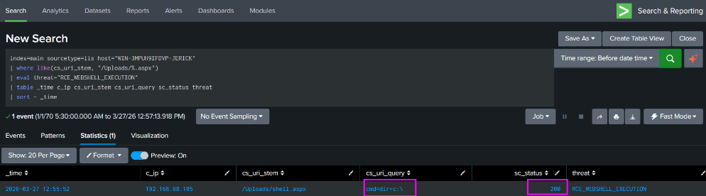
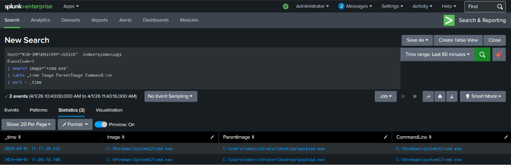
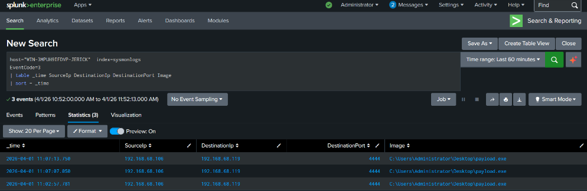
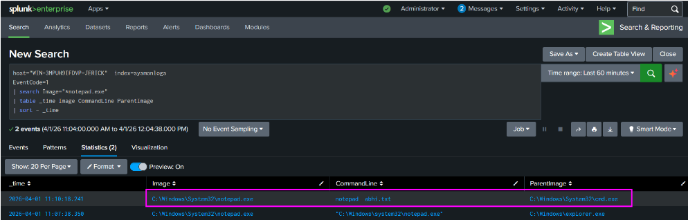
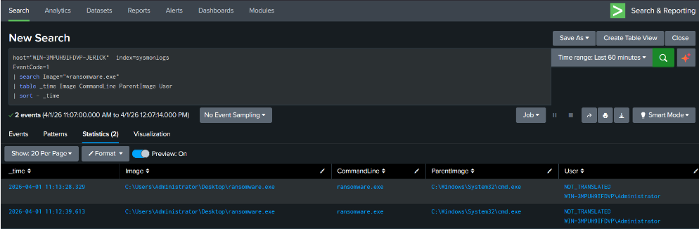
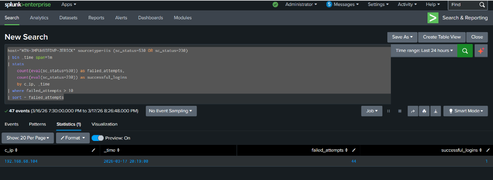
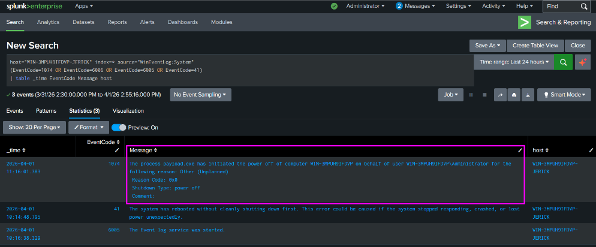

# Lab 04: Endpoint Threat Detection & Defense Evasion

## Ingestion Overview
* **Target Host:** `WIN-3MPUH9IFDVP-JERICK`
* **Telemetry Sources:**
  * Microsoft-Windows-Sysmon/Operational (`index=sysmonlogs`)
  * Windows System & Security Event Logs (`index=*`, `source="WinEventLog:System"`)
  * Microsoft IIS W3C Logs (`sourcetype=iis`)
* **Key Event IDs Monitored:**
  * Event ID 1: Process Creation
  * Event ID 3: Network Connection
  * Event ID 11: File Creation
  * Event ID 23 / 26: File Deletion
  * Event ID 1074: User-Initiated Shutdown
  * Event ID 1102 / 104: Audit Logs Cleared

---

## 1. Web Shell Upload & Remote Code Execution (RCE)

### Attack Objective
An attacker uploads a malicious `.aspx` backdoor to the publicly accessible `/Uploads/` directory and executes system commands remotely.

### Web Tier Detection (IIS W3C)
```spl
index=main sourcetype=iis host="WIN-3MPUH9IFDVP-JERICK"
| where like(cs_uri_stem, "/Uploads/%.aspx")
| eval threat="RCE_WEBSHELL_EXECUTION"
| table _time c_ip cs_uri_stem cs_uri_query sc_status threat
| sort - _time
```



### Correlated Web Shell Execution (IIS + Sysmon Event ID 1)
Correlates the IIS HTTP request with Sysmon process telemetry where the web server worker (`w3wp.exe`) spawns an interactive command shell (`cmd.exe` or `powershell.exe`) within 120 seconds:

```spl
(
    index=sysmonlogs EventCode=1
    ParentImage="*w3wp.exe"
    (Image="*cmd.exe" OR Image="*powershell.exe")
)
| rename _time as process_time
| join host [
    search index=main sourcetype=iis cs_uri_stem="/Uploads/shell.aspx"
    | rename _time as web_time
    | table web_time host c_ip
]
| eval time_diff=abs(process_time - web_time)
| where time_diff < 120
| stats 
    count as execution_count
    earliest(process_time) as first_seen
    latest(process_time) as time
    values(CommandLine) as commands
    by host c_ip
| eval time=strftime(time,"%Y-%m-%d %H:%M:%S")
| eval commands=mvjoin(commands," | ")
| eval AttackType="Confirmed Web Shell Execution"
| table time host c_ip execution_count commands AttackType
```

---

## 2. Metasploit & Meterpreter Shell Detection

### A. Meterpreter Command Shell Spawn (Sysmon Event ID 1)
Flags instances where an anomalous executable spawns an interactive command interpreter:
```spl
index=sysmonlogs host="WIN-3MPUH9IFDVP-JERICK"
EventCode=1
| search (Image="*cmd.exe" AND ParentImage="*.exe" AND CommandLine="*cmd.exe")
| table _time Image ParentImage CommandLine
```



### B. Reverse Shell Network Callbacks (Sysmon Event ID 3)
Tracks anomalous egress network connections initiated by host processes:
```spl
index=sysmonlogs host="WIN-3MPUH9IFDVP-JERICK"
EventCode=3
| table _time SourceIp DestinationIp DestinationPort Image
```



---

## 3. Suspicious Process Behaviors & Ransomware Activity

### A. Anomalous Child Process Spawning (`cmd.exe` spawning `notepad.exe`)
```spl
index=sysmonlogs host="WIN-3MPUH9IFDVP-JERICK"
EventCode=1
| search (Image="*notepad.exe" AND ParentImage="*cmd.exe")
| table _time Image CommandLine ParentImage
```



### B. Suspicious Binary Execution from User Directories
```spl
index=* sourcetype="sysmon" host="WIN-3MPUH9IFDVP-JERICK" EventCode=1
| search (Image="*\\Users\\*" AND Image="*.exe")
| search NOT (Image="*\\AppData\\Local\\Microsoft\\Teams\\*" OR Image="*\\AppData\\Local\\Programs\\Loom\\*") 
| table _time ParentImage Image CommandLine
```



### C. File Manipulation Tracking (Event IDs 11 & 23)
* **File Creation Tracking:**
```spl
index=sysmonlogs EventCode=11 OR EventCode=23
| search Image="*cmd.exe"
| table _time TargetFilename Image 
| sort - _time
```

* **Mass File Deletion Tracking:**
```spl
index=sysmonlogs (EventCode=23 OR EventCode=26)
| search Image="*cmd.exe"
| table _time TargetFilename Image EventCode
```

---

## 4. Multi-Vector Malware Scoring Model

Aggregates process creation, network callbacks, PowerShell encoding, and file operations within a 5-minute window to assign a weighted threat score:

```spl
index=sysmonlogs host="WIN-3MPUH9IFDVP-JERICK" (EventCode=1 OR EventCode=3 OR EventCode=11 OR EventCode=23)
| bin _time span=5m
| eval file_create = if((EventCode=11 OR EventCode=23) AND like(Image,"%cmd.exe"),1,0)
| eval exe_exec = if(EventCode=1 AND like(Image,"%.exe") AND like(ParentImage,"%cmd.exe"),1,0)
| eval cmd_spawn = if(EventCode=1 AND like(Image,"%cmd.exe") AND like(ParentImage,"%.exe"),1,0)
| eval ps_encoded = if(EventCode=1 AND like(Image,"%powershell.exe") AND like(CommandLine,"% -enc%"),1,0)
| eval network = if(EventCode=3,1,0)
| eval payload_candidate = if(EventCode=1 AND like(Image,"%.exe"), Image, null())
| eval suspicious_payload = if(
    match(payload_candidate,"(?i)\\\\Users\\\\|\\\\Temp\\\\|\\\\Downloads\\\\|\\\\Desktop\\\\"),
    payload_candidate,
    null()
)
| eval attacker_ip = if(EventCode=3, DestinationIp, null())
| stats 
    max(file_create) as file_create
    max(exe_exec) as exe_exec
    max(cmd_spawn) as cmd_spawn
    max(ps_encoded) as ps_encoded
    max(network) as network
    values(payload_candidate) as all_payloads
    values(suspicious_payload) as suspicious_payloads
    values(attacker_ip) as attacker_ip
    earliest(_time) as First_Seen
    by host _time
| eval raw_payloads = if(
    mvcount(suspicious_payloads)>0,
    suspicious_payloads,
    all_payloads
)
| eval Potential_Malware = mvfilter(isnotnull(raw_payloads))
| eval Potential_Malware = mvmap(Potential_Malware, mvindex(split(Potential_Malware,"\\"), -1))
| where mvcount(Potential_Malware) > 0
| eval Malware_Score = file_create + exe_exec + cmd_spawn + ps_encoded + network
| where Malware_Score >= 3 OR isnotnull(attacker_ip)
| eval Severity=case(
    isnotnull(attacker_ip),"Critical Malware",
    Malware_Score>=4,"High Confidence Malware",
    Malware_Score>=3,"Suspicious Activity"
)
| eval First_Seen=strftime(First_Seen,"%Y-%m-%d %H:%M:%S")
| eval Technique="Process Injection / Reverse Shell Behavior"
| table host Potential_Malware attacker_ip Severity First_Seen Technique
| sort - Malware_Score
| dedup host
```

---

## 5. Credential Access & Defense Evasion

### A. FTP Credential Brute-Force
Detects rapid repeated login failures (`sc_status=530`) followed by access (`sc_status=230`):
```spl
host="WIN-3MPUH9IFDVP-JERICK" sourcetype=iis (sc_status=530 OR sc_status=230)
| bin _time span=1m
| stats 
    count(eval(sc_status=530)) as failed_attempts,
    count(eval(sc_status=230)) as successful_logins
    by c_ip, _time
| where failed_attempts > 10
| sort - failed_attempts
```



### B. User-Initiated Host Shutdown
Tracks manual system terminations using Event ID 1074:
```spl
host="WIN-3MPUH9IFDVP-JERICK" index=* source="WinEventLog:System" 
| search NOT (winlogon.exe OR Explorer.EXE OR RuntimeBroker.exe) (EventCode=1074)
| table _time EventCode Message host
```



### C. Log Tampering & Service Manipulation
Monitors clearing of event logs or unauthorized stopping of the event logging service:
* **Event ID 1102:** Security audit log was cleared
* **Event ID 104:** System log was cleared
* **Event ID 7036 / 7040:** Event Log service state changed / stopped
