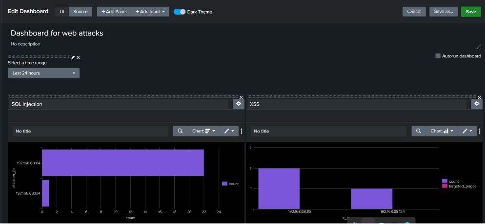
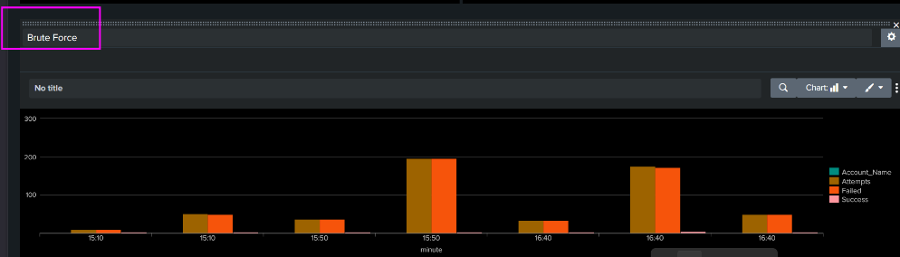
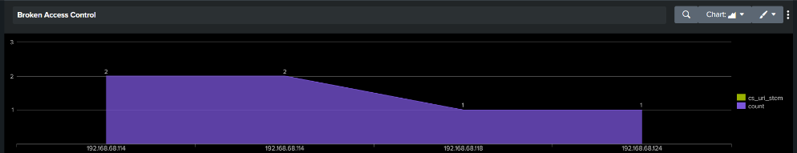
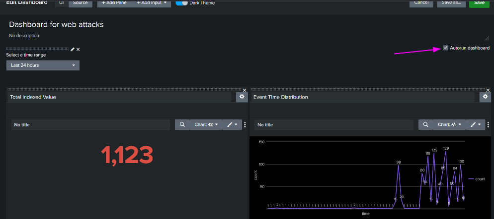

# Lab 05: Enterprise SOC Dashboarding & Alert Auditing

## Overview
This module consolidates threat detections across perimeter, web, and endpoint telemetry into a unified Security Operations Center (SOC) dashboard. The interface enables real-time threat triage across web application attacks, authentication brute-force anomalies, and triggered alert distribution timelines.

---

## 1. Unified Operational SOC Dashboard Panels

### A. SQL Injection & Reflected XSS Monitoring
Tracks targeted endpoints, script injection attempts, and payload volumes categorized by source IP:

```spl
# SQL Injection Telemetry Query
index=main sourcetype=iis host="WIN-3MPUH9IFDVP-JERICK"
| regex cs_uri_query="(?i)(union|select|or\s+1=1|%27|--|drop\s+table)"
| stats count values(cs_uri_stem) as targeted_pages values(cs_uri_query) as payloads values(sc_status) as status_codes latest(_time) as last_attempt by c_ip
| eval attack_time=strftime(last_attempt,"%Y-%m-%d %H:%M:%S")
| eval threat="SQL_INJECTION_ATTEMPT"
| rename c_ip as attacker_ip
| table attacker_ip count
| sort - count
```

```spl
# Reflected XSS Query
index=main sourcetype=iis host="WIN-3MPUH9IFDVP-JERICK"
| regex cs_uri_query="(?i)(<script|%3cscript|javascript:|onerror=|onload=|alert\()"
| stats count values(cs_uri_query) as payloads values(cs_uri_stem) as targeted_pages by c_ip
| eval threat="XSS_ATTACK_ATTEMPT"
| sort - count
```



---

### B. Authentication Brute-Force Monitoring Panel
Surfaces high-frequency failed authentications across web login endpoints:

```spl
host="WIN-3MPUH9IFDVP-JERICK"
sourcetype=iis
cs_uri_stem="/Account/Login"
cs_method=POST
| stats count by c_ip
| where count > 10
| eval threat="BRUTE_FORCE_LOGIN"
```



---

### C. Broken Access Control & Administrative Exposure Panel
Monitors unauthenticated requests reaching administrative routes (`/Admin*`) and sensitive directory listing attempts:

```spl
index=main sourcetype=iis host="WIN-3MPUH9IFDVP-JERICK" cs_uri_stem="/Admin*" cs_method="GET" sc_status="200"
| table _time c_ip cs_uri_stem sc_status
| eval threat="UNAUTHORIZED_ADMIN_ACCESS"
| sort - _time
```



---

## 2. Real-Time Alert Distribution & Auditing

Monitors the internal Splunk audit log to track triggered alerts, expiration TTL, and severity across operational workflows:

```spl
index=_audit action=alert_fired ss_app=* 
| eval ttl=expiration-now() 
| search ttl>0 
| convert ctime(trigger_time) 
| table ss_name severity trigger_time 
| rename trigger_time as "Alert Time" ss_name as "Alert Name" severity as "Severity"
```


